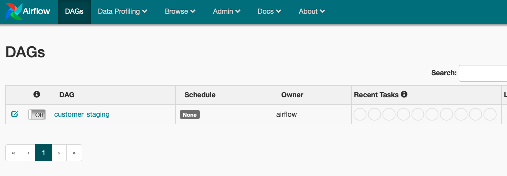
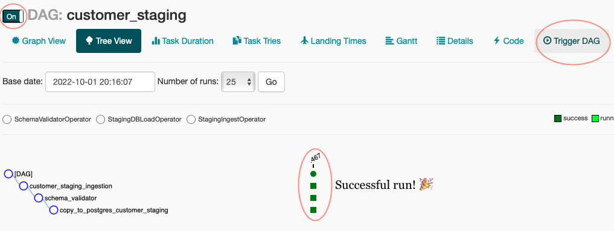
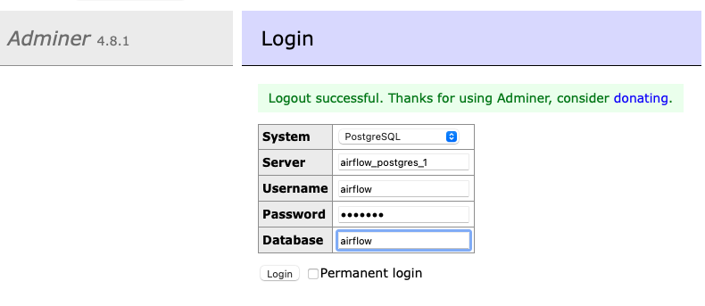
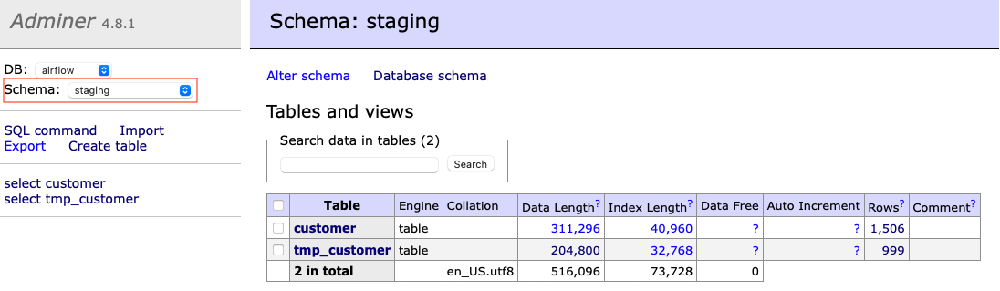
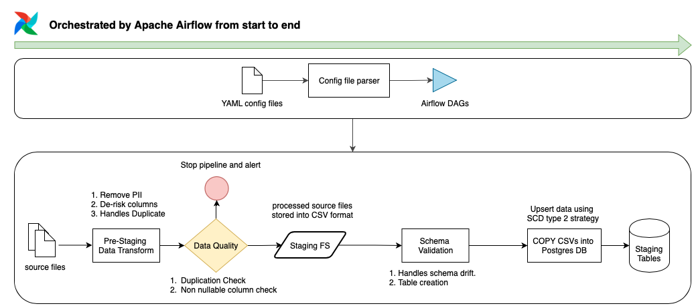

# ETL Framework
This exercise involves the ingestion of JSON lines format dataset to a target data warehouse.


#### Requirements for data transformation and data warehousing
1. PII information must be removed - `C_FIRST_NAME`, `C_LAST_NAME`.
2. `C_EMAIL_ADDRESS` field is recoded to `C_EMAIL_DOMAIN` and delete the original field.
3. Write resulting output to another file.
4. Table must contain historical values for analysis.


## Installation
Prerequisite to run this application

- Docker

Once docker is installed and running, in the repo's root folder, run docker compose up to start all the services required for the app.
```
docker-compose up
```
The services required for this app includes :

- Python App for DAG initialisation
- Postgresql
- Airflow
- Adminer

## Running the Pipeline
Once all services are running, access the Airflow web UI at `localhost:8080` with your desired browser. You will see this: 



#### Steps:
1. Turn on the dag by switching the Off Switch to On. (hint: beside customer_staging).
2. Access the DAG by clicking on `customer_staging`.
3. Once in the dag, check if the DAG has been switched on then click on 'Trigger DAG' button to run the DAG.
4. The ETL is successful once all tasks are displaying green blocks. (see image below)

5. To check & validate staging data, the application's postgres db can be accessed with the following credentials using your favourite SQL client (with mine being (DBeaver)[dbeaver.io]).

|||
|---|---|
|host|airflow_postgres_1|
|username|airflow|
|password|airflow|
|database|airflow|

The table name is `staging.customer`.

#### Adminer
I have included [Adminer](https://www.adminer.org) into this docker deployment just in case. Go to `localhost:3000` and log in with the above credentials. 

You should be able to see the tables once you switch the schema to `staging`.


## Documentation
Following diagram illustrate the data pipeline framework that caters to the requirements above.



A python app is used to parse YAML formatted [data pipeline config files](https://github.com/aaronegh/airflow-etl/blob/master/dags/config/customer_staging.yaml). By writting config files, this allows data engineers to reuse [ETL operators](https://github.com/aaronegh/airflow-etl/tree/master/plugins/operators) (custom/built-in) in Airflow for pipelines that follow similar ETL patterns. For the pipeline in this execise, it is assumed that source data will be available in a JSON line format consecutively and similiarly for other data coming from the same source. The extracted data will be transformed subsequently and loaded into Postgres DB.

In detail, the pipeline performs the following tasks :

1. Ingest JSON lines formatted .txt files
2. Performs a set of transformations : 
    - Removing PII data 
    - Extract email domain and drop email column
    - Handles duplications
3. Performs a set of data quality (DQ) tasks:
    - Duplication Check
    - Ensure non nullable columns do not contain nulls
4. Writes the manipulated data into CSV
5. Peforms a set of validation tasks between source and target:
    - Handles schema drift by adding new columns into target table if detected.
    - Creates target table if not available (for new pipelines)
6. Load CSVs into Postgres DB
    - Staging tables are designed to be SCD type 2 to store historical data
    - SCD type 2 columns:
        - IS_CURRENT - Indicates current records
        - CREATED_BY - Source data versioning
        - ETL_DATETIME - Record inserted date
        - DEACTIVATED_DATE - Record deactivation date
    - Python will perform a COPY operation on CSV file into a temporary table.
    - A comparison between the temporary table and the SCD type 2 staging table is performed to detect changes in data based on a primary key (e.g. `C_CUSTOMER_ID`).
        - New data will be inserted (e.g. customer do not exist).
        - Changes to existing data (e.g. customer exist but has updated entries) will result in the deactivated of the older record by setting `IS_CURRENT` column to `'N'` and updating the `DEACTIVATED_DATE` column with a timestamp signifying the time of the ETL event.


## Suggested Improvements
1. Field encryption function can be added into pre-staging transformation step to further de-risk data pipeline.
2. DQ functions can be handled by tools such as [Great Expectations](https://greatexpectations.io).
3. If the existing data architecture allows cheap storage cost, [dimension snapshotting](https://www.jie-tao.com/scd-ii-or-snapshot-for-dimension/) approach can be considered beside SCD type 2, which aims to create immutable and reproducible data pipelines that are easier to maintain and manage.
